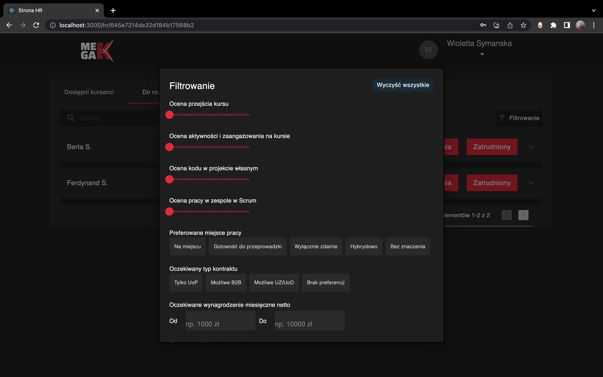

# Project HeadHunter Frontend
This is the group project for Mega Kurs. 
## Table of Contents
* [General info](#general-info)
* [Screenshots](#screenshots)
* [Technologies used](#technologies-used)
* [Usage](#usage)
* [Contact](#contact)

## General Info
Group project carried out to specification and mock-ups provided. Working in scram technology, under the supervision of a global Scrum Master and the client.

## Screenshots

## Technologies Used
    
  

## Usage
### Available Scripts

In the project directory, you can run:

#### `npm start`

Runs the app in the development mode.\
Open [http://localhost:3000](http://localhost:3000) to view it in the browser.

The page will reload if you make edits.\
You will also see any lint errors in the console.

#### `npm test`

Launches the test runner in the interactive watch mode.\
See the section about [running tests](https://facebook.github.io/create-react-app/docs/running-tests) for more information.

#### `npm run build`

Builds the app for production to the `build` folder.\
It correctly bundles React in production mode and optimizes the build for the best performance.

The build is minified and the filenames include the hashes.\
Your app is ready to be deployed!

## Contact
Created by:
designbymilencja@gmail.com
rafal.szczepanik23@gmail.com
markiewicz267@gmail.com 
s.nadolny@hotmail.com
greg.wachenek@gmail.com
- feel free to contact us!
